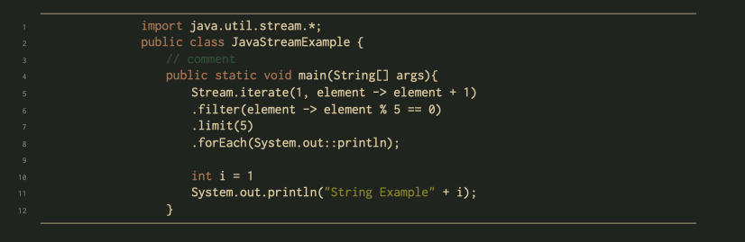
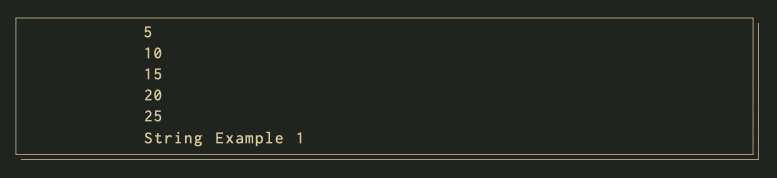
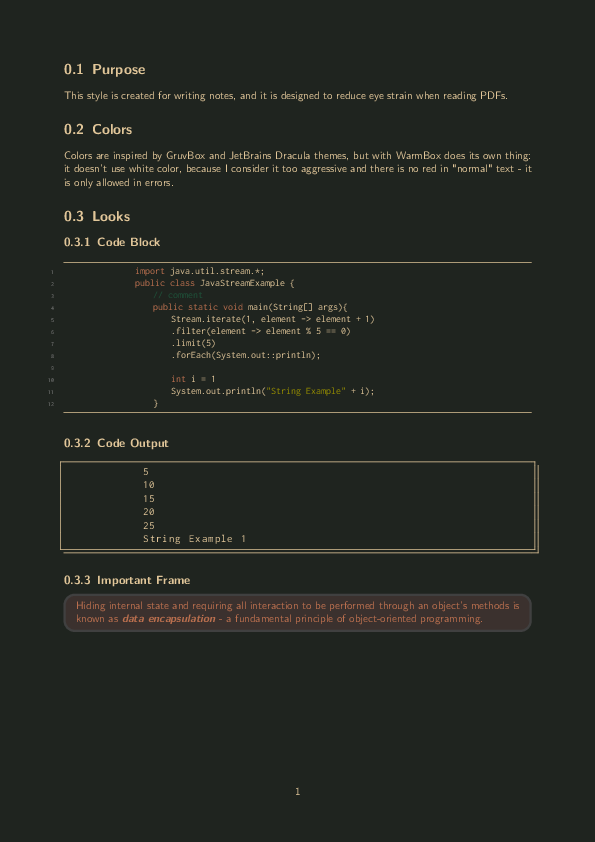

# WarmBox $\LaTeX$ Colorscheme

## Purpose

This style is created for writing notes, and it is designed to reduce eye strain when reading PDFs.

## Colors

Colors are inspired by GruvBox and JetBrains Dracula themes, but with WarmBox does its own thing: it doesn’t use white color, because I consider it too aggressive and there is no red in "normal" text - it is only allowed in errors.

This style is created for writing notes, and it is designed to reduce eye strain when reading PDFs.

## Looks

### Code Block

### Code Output

### Important Frame

---

## Example 

